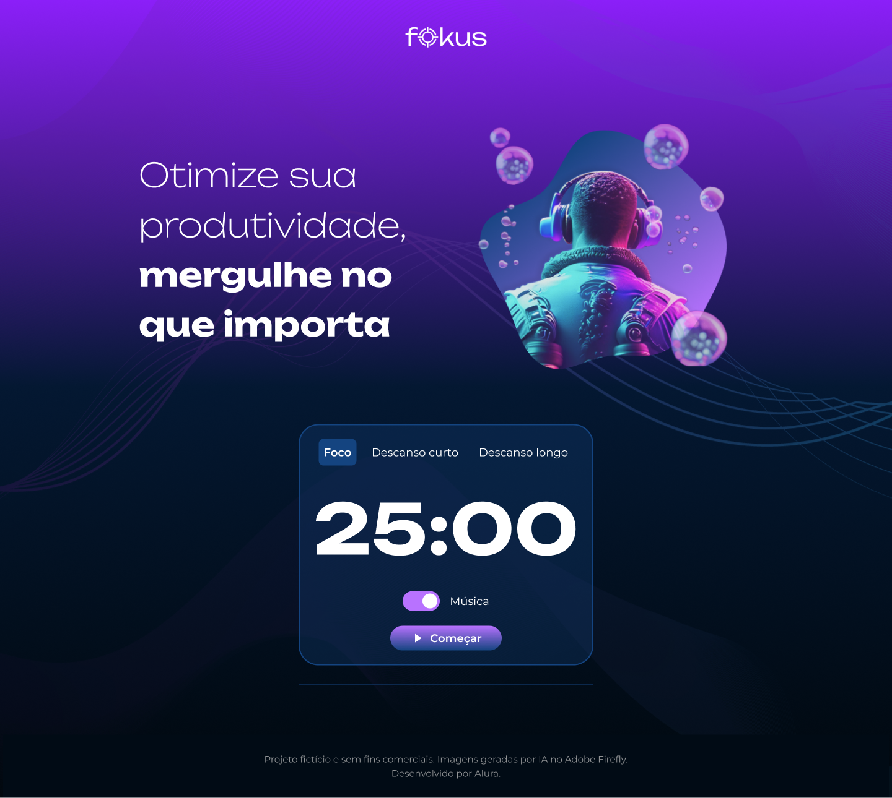

# Projeto Fokus

## Descrição
Este é um projeto fictício desenvolvido durante o curso "JavaScript: Manipulando Elementos com DOM" da Alura. O objetivo do projeto é criar uma aplicação que ajuda a otimizar a produtividade dos usuários, proporcionando um temporizador para períodos de foco, descanso curto e descanso longo.



## Funcionalidades
- **Foco**: Temporizador de 25 minutos para períodos de trabalho concentrado.
- **Descanso Curto**: Temporizador de 5 minutos para pequenas pausas.
- **Descanso Longo**: Temporizador de 15 minutos para pausas mais longas.
- **Música**: Opção para alternar a reprodução de música durante os períodos de foco.

## Tecnologias Utilizadas
- HTML
- CSS
- JavaScript

## Como Executar o Projeto

### Passos
1. Clone este repositório:
    ```bash
    git clone https://github.com/seu-usuario/fokus.git
    ```
2. Navegue até o diretório do projeto:
    ```bash
    cd fokus
    ```
3. Abra o arquivo `index.html` no seu navegador.

## Estrutura do Projeto

```
|-- imagens/
|   |-- favicon.ico
|   |-- foco.png
|   |-- logo.png
|   |-- play_arrow.png
|   |-- pause.png
|   |-- short.png
|   |-- long.png
|-- sons/
|   |-- luna-rise-part-one.mp3
|   |-- play.wav
|   |-- pause.mp3
|   |-- beep.mp3
|-- styles.css
|-- script.js
|-- index.html
```

## Código

### JavaScript

O JavaScript do projeto Fokus é responsável por controlar a lógica do temporizador, alternar entre diferentes modos (foco, descanso curto e descanso longo) e gerenciar a reprodução de música. Vamos analisar o código em detalhes.

### Seleção de Elementos

```javascript
const html = document.querySelector('html');
const focoBt = document.querySelector('.app__card-button--foco');
const curtoBt = document.querySelector('.app__card-button--curto');
const longoBt = document.querySelector('.app__card-button--longo');
const banner = document.querySelector('.app__image');
const titulo = document.querySelector('.app__title');
const botoes = document.querySelectorAll('.app__card-button');
const startPauseBt = document.querySelector('#start-pause');
const iniciarOuPausarBt = document.querySelector('#start-pause span');
const iniciarOuPausarBtIcone = document.querySelector(".app__card-primary-butto-icon");
const tempoNaTela = document.querySelector('#timer');
const musicaFocoInput = document.querySelector('#alternar-musica');
```

- Estes seletores capturam os elementos HTML que serão manipulados, incluindo botões, imagens, títulos e o temporizador.

### Configuração de Áudio

```javascript
const musica = new Audio('/sons/luna-rise-part-one.mp3');
const audioPlay = new Audio('/sons/play.wav');
const audioPausa = new Audio('/sons/pause.mp3');
const audioTempoFinalizado = new Audio('./sons/beep.mp3');
musica.loop = true;
```

- Aqui, são criadas instâncias de áudio para diferentes sons usados no projeto: música de fundo, sons de início e pausa, e um som de finalização do temporizador.

### Variáveis de Estado

```javascript
let tempoDecorridoEmSegundos = 1500;
let intervaloId = null;
```

- `tempoDecorridoEmSegundos` mantém o tempo restante em segundos. Inicia com 1500 segundos (25 minutos).
- `intervaloId` é usado para armazenar o identificador do intervalo do temporizador, permitindo que ele seja iniciado e parado.

### Alternar Música

```javascript
musicaFocoInput.addEventListener('change', () => {
    if (musica.paused) {
        musica.play();
    } else {
        musica.pause();
    }
});
```

- Este ouvinte de eventos alterna a reprodução da música de fundo quando o checkbox é alterado.

### Alterar Contexto

```javascript
function alterarContexto(contexto) {
    mostrarTempo();
    botoes.forEach(function (contexto) {
        contexto.classList.remove('active');
    });
    html.setAttribute('data-contexto', contexto);
    banner.setAttribute('src', `/imagens/${contexto}.png`);
    switch (contexto) {
        case "foco":
            titulo.innerHTML = `Otimize sua produtividade,<br>
                <strong class="app__title-strong">mergulhe no que importa.</strong>`;
            break;
        case "descanso-curto":
            titulo.innerHTML = `Que tal dar uma respirada?<br> 
            <strong class="app__title-strong">Faça uma pausa curta!</strong>`;
            break;
        case "descanso-longo":
            titulo.innerHTML = `Hora de voltar à superfície.<br>
            <strong class="app__title-strong">Faça uma pausa longa.</strong>`;
        default:
            break;
    }
}
```

- `alterarContexto` altera o estado da aplicação baseado no modo selecionado (foco, descanso curto ou longo). Atualiza o tempo, remove a classe `active` dos botões, muda a imagem e o texto do título.

### Manipulação dos Botões

```javascript
focoBt.addEventListener('click', () => {
    tempoDecorridoEmSegundos = 1500;
    alterarContexto('foco');
    focoBt.classList.add('active');
});

curtoBt.addEventListener('click', () => {
    tempoDecorridoEmSegundos = 300;
    alterarContexto('descanso-curto');
    curtoBt.classList.add('active');
});

longoBt.addEventListener('click', () => {
    tempoDecorridoEmSegundos = 900;
    alterarContexto('descanso-longo');
    longoBt.classList.add('active');
});
```

- Cada botão tem um ouvinte de evento que altera o tempo e o contexto da aplicação, além de adicionar a classe `active` ao botão clicado.

### Temporizador

```javascript
const contagemRegressiva = () => {
    if (tempoDecorridoEmSegundos <= 0) {
        audioTempoFinalizado.play();
        alert('Tempo finalizado!');
        zerar();
        return;
    }
    tempoDecorridoEmSegundos -= 1;
    mostrarTempo();
}
```

- `contagemRegressiva` é a função que decrementa o tempo a cada segundo e atualiza a exibição do tempo. Quando o tempo chega a zero, toca um som, mostra um alerta e zera o temporizador.

### Iniciar e Pausar Temporizador

```javascript
startPauseBt.addEventListener('click', iniciarOuPausar);

function iniciarOuPausar() {
    if (intervaloId) {
        audioPausa.play();
        zerar();
        return;
    }
    audioPlay.play();
    intervaloId = setInterval(contagemRegressiva, 1000);
    iniciarOuPausarBt.textContent = "Pausar";
    iniciarOuPausarBtIcone.setAttribute('src', `/imagens/pause.png`);
}

function zerar() {
    clearInterval(intervaloId);
    iniciarOuPausarBt.textContent = "Começar";
    iniciarOuPausarBtIcone.setAttribute('src', `/imagens/play_arrow.png`);
    intervaloId = null;
}
```

- `iniciarOuPausar` alterna o estado do temporizador entre iniciado e pausado. Se já estiver rodando, pausa o temporizador e toca o som de pausa. Se não estiver rodando, inicia o temporizador e toca o som de início.
- `zerar` para o temporizador e reseta o texto e ícone do botão.

### Atualizar e Mostrar Tempo

```javascript
function mostrarTempo() {
    const tempo = new Date(tempoDecorridoEmSegundos * 1000);
    const tempoFormatado = tempo.toLocaleTimeString('pt-br', { minute: '2-digit', second: '2-digit' });
    tempoNaTela.innerHTML = `${tempoFormatado}`;
}

mostrarTempo();
```

- `mostrarTempo` converte o tempo restante em um formato legível (minutos e segundos) e exibe na tela. A função é chamada para exibir o tempo inicial.

## Link do Figma
Você pode visualizar o design do projeto no Figma [aqui](https://www.figma.com/design/dEaMv34Wd5G7TBMPo8fPlK/Projeto-Fokus?node-id=78-423&t=bF9pQwFJIIWb4Nli-0).

## Link do Vercel
Você pode visualizar a aplicação hospedada no Vercel [aqui](https://fokus-two-omega.vercel.app/).